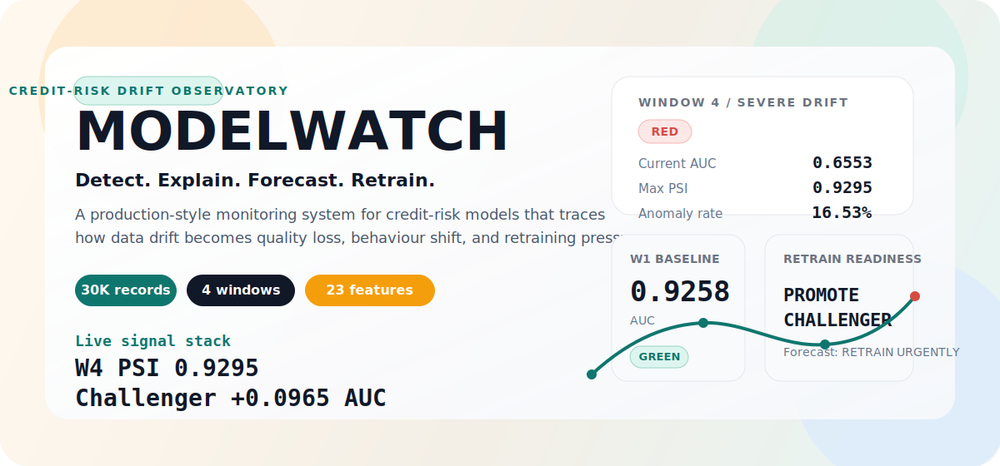
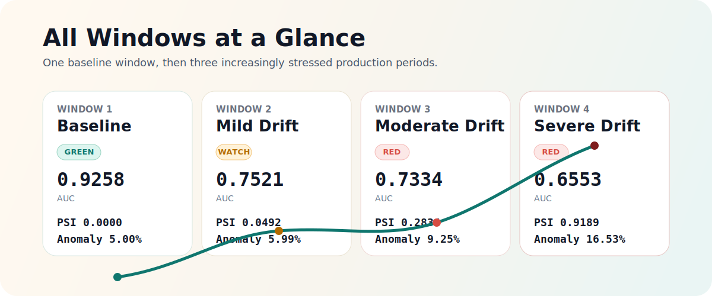
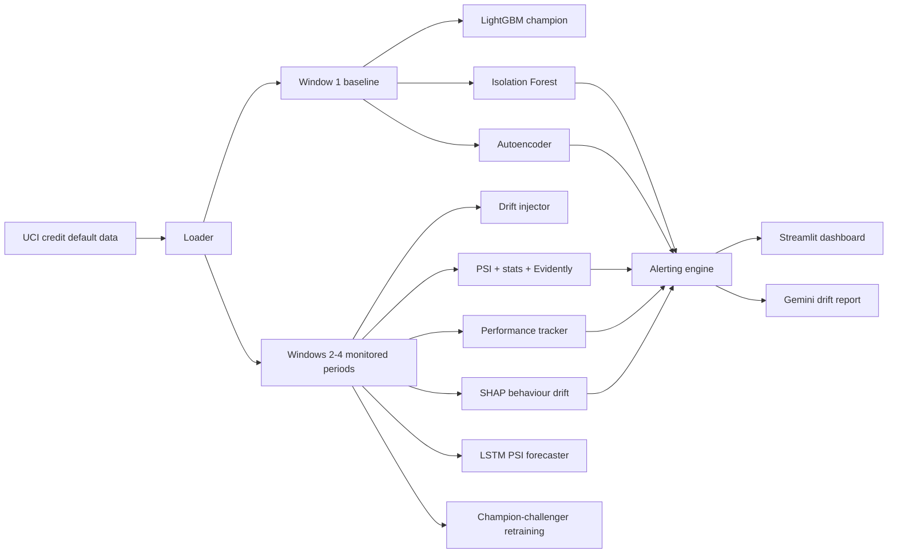

<div align="center">

<h1><strong>MODELWATCH</strong></h1>

<p><strong>Production ML drift observatory for credit-risk systems.</strong></p>
<p>Detect distribution shift, performance decay, behaviour drift, anomaly spikes, and retraining readiness before silent model failure compounds into business damage.</p>

[](https://yaswtutu-modelwatch.hf.space)
[](https://huggingface.co/spaces/yaswtutu/modelwatch)
[](https://github.com/yaswankum2622-code/modelwatch)
[](https://github.com/yaswankum2622-code/modelwatch/actions)

ModelWatch is a production-style monitoring platform built on the UCI Credit Card Default dataset.  
It shows the full post-deployment story: the data moves, quality erodes, feature importance shifts, anomalies rise, and the team needs an evidence-based retraining decision.

</div>



---

## Why this project exists

Many ML projects stop at training accuracy. Real systems fail later, in production, when the incoming data no longer looks like the data the model learned from.

ModelWatch focuses on that operational layer:

- **Data drift:** PSI, KS test, Jensen-Shannon divergence, chi-square, Evidently AI
- **Performance drift:** AUC, F1, precision, recall, KS statistic across monitoring windows
- **Deep drift signals:** Isolation Forest anomaly density and autoencoder reconstruction error
- **Behaviour drift:** SHAP feature-importance rank correlation
- **Decision support:** champion-challenger retraining loop, LSTM drift forecasting, Gemini-generated executive report

> A deployed model rarely fails loudly.  
> It drifts quietly, keeps scoring confidently, and starts making worse decisions on data it no longer understands.  
> **ModelWatch is built to catch that before operators notice only after the damage.**

## At a glance

- **Dataset:** UCI Credit Card Default, 30,000 real customer records
- **Feature space:** 23 monitored production features across demographics, balances, payments, and delinquency
- **Monitoring story:** 1 baseline window plus 3 progressively drifted windows
- **Detection stack:** PSI, KS, JS divergence, chi-square, SHAP drift, Isolation Forest, autoencoder, Evidently AI
- **Decision layer:** champion-challenger retraining loop, LSTM drift forecast, Gemini executive report
- **Deployment:** multi-page Streamlit dashboard live on Hugging Face Spaces

---

## What a monitoring window means

A **window** is one batch of production records observed later in time.

- **Window 1** is the clean baseline used for training.
- **Window 2** introduces mild drift.
- **Window 3** introduces moderate drift.
- **Window 4** introduces severe drift.

This creates a realistic monitoring story: the model is good at launch, then the environment changes.



### Window summary from the current run

| Window | Role | Records | Default rate | `BILL_AMT1` mean | `PAY_0` mean | `PAY_6` mean |
|---|---:|---:|---:|---:|---:|---:|
| W1 | Baseline | 7,500 | 22.2% | 51,274 | -0.011 | -0.293 |
| W2 | Mild drift | 7,500 | 21.8% | 54,170 | 0.156 | -0.114 |
| W3 | Moderate drift | 7,500 | 22.4% | 61,195 | 0.541 | 0.267 |
| W4 | Severe drift | 7,500 | 22.1% | 74,514 | 1.170 | 0.898 |

Interpretation:

- Bill amounts rise steadily from W1 to W4.
- Repayment status variables move toward larger delay values.
- The label rate stays broadly realistic, so the story is not driven by a trivial class-ratio trick.

---

## The 23 monitored features

| Group | Features | Why they matter |
|---|---|---|
| Customer profile | `LIMIT_BAL`, `SEX`, `EDUCATION`, `MARRIAGE`, `AGE` | Who the client is and their broad credit context |
| Repayment status | `PAY_0`, `PAY_2`, `PAY_3`, `PAY_4`, `PAY_5`, `PAY_6` | Recent delinquency behaviour and missed-payment stress |
| Billing exposure | `BILL_AMT1` to `BILL_AMT6` | Outstanding balance pressure across recent statements |
| Payment behaviour | `PAY_AMT1` to `PAY_AMT6` | How much the customer is actually repaying over time |

The most important drifted features in this project are the repayment-status variables, especially `PAY_0`, `PAY_6`, `PAY_4`, `PAY_3`, and `PAY_2`.

---

## All windows comparison

This is the core operating view of the project: one baseline and three progressively stressed monitoring periods.

| Window | Health | AUC | F1 | Max PSI | Mean PSI | Red PSI features | Anomaly rate | AE drift ratio | SHAP rank corr | Reading |
|---|---|---:|---:|---:|---:|---:|---:|---:|---:|---|
| W1 | GREEN | 0.9258 | 0.7382 | 0.0000 | 0.0000 | 0 | 5.00% | 1.000x | 1.0000 | Clean reference period |
| W2 | RED | 0.7521 | 0.5025 | 0.0492 | 0.0140 | 0 | 5.99% | 1.034x | 0.9417 | Performance degrades before strong PSI alarms |
| W3 | RED | 0.7334 | 0.4728 | 0.2834 | 0.0494 | 1 | 9.25% | 1.204x | 0.7984 | Drift becomes clear across multiple detectors |
| W4 | RED | 0.6553 | 0.4104 | 0.9189 | 0.1710 | 6 | 16.53% | 1.291x | 0.6166 | Severe production drift and behaviour change |

### What this comparison tells us

- The model loses **29.2% AUC** from W1 to W4.
- PSI becomes extreme in W4, with `PAY_0` reaching **0.9189**.
- Unsupervised signals confirm the same story: anomaly rate rises to **16.53%** and autoencoder error rises to **1.291x** baseline.
- SHAP rank correlation falls to **0.6166**, which means the model is not just worse, it is making decisions differently.

---

## What each graph is telling you

| Dashboard view | What it measures | How to read it |
|---|---|---|
| **Overview / command deck** | Window-by-window health and alert load | Fast operational answer: which window is broken and how badly |
| **PSI heatmap** | Feature-level distribution shift across windows | Darker cells mean the feature has moved further away from the baseline distribution |
| **Feature trajectory spotlight** | Raw movement of top drifted features | Useful for understanding *how* a feature is changing, not just that it changed |
| **Performance observatory** | AUC, F1, precision, recall over time | Shows whether the model is still separating risky vs safe customers well |
| **Champion-challenger panel** | Whether retraining actually helps | Turns `we should retrain` into a measurable before/after comparison |
| **Deep drift lab** | Autoencoder and Isolation Forest signals | Captures stress even when classical feature thresholds do not yet look extreme |
| **SHAP drift page** | Feature-importance rank movement | Detects behaviour drift: the model may still run, but for the wrong reasons |
| **Executive drift narrative** | AI-generated explanation for stakeholders | Converts monitoring metrics into an action-oriented operational brief |

---

## Current findings from the live run

### 1. Data drift is concentrated in repayment status

Top PSI features in Window 4:

| Feature | PSI | Status |
|---|---:|---|
| `PAY_0` | 0.9189 | RED |
| `PAY_6` | 0.4693 | RED |
| `PAY_4` | 0.4265 | RED |
| `PAY_3` | 0.4026 | RED |
| `PAY_2` | 0.3962 | RED |

These are exactly the kinds of features that matter most in credit-risk scoring. The model is now seeing repayment behaviour that looks materially different from its training distribution.

### 2. Model quality has clearly degraded

| Metric | Window 1 | Window 4 | Change |
|---|---:|---:|---:|
| AUC | 0.9258 | 0.6553 | -29.2% |
| F1 | 0.7382 | 0.4104 | -44.4% |
| Precision | 0.6594 | 0.2725 | -58.7% |
| Recall | 0.8384 | 0.8306 | -0.9% |
| KS statistic | 0.7228 | 0.2467 | -65.9% |

The model keeps recall high, but precision collapses. In operational terms, that means it starts flagging far more customers as risky without maintaining the same discrimination quality.

### 3. Deep drift detectors agree with the classical metrics

| Detector | Window 1 | Window 4 | Interpretation |
|---|---:|---:|---|
| Isolation Forest anomaly rate | 5.00% | 16.53% | A much larger share of records looks out-of-distribution |
| Autoencoder drift ratio | 1.000x | 1.291x | Incoming data is harder to reconstruct from baseline patterns |
| SHAP rank correlation | 1.0000 | 0.6166 | The model is relying on features differently than before |

### 4. Retraining is justified, not just suggested

| Model | Evaluation window | AUC | F1 |
|---|---:|---:|---:|
| Champion | W4 holdout | 0.6317 | 0.3998 |
| Challenger trained on recent data | W4 holdout | 0.7459 | 0.4908 |

**AUC improvement:** `+0.1143`  
**Decision:** `PROMOTE CHALLENGER`

### 5. The next window is forecast to remain unhealthy

The LSTM sequence forecaster projects:

- **Predicted Window 5 mean PSI:** `0.5294`
- **Predicted Window 5 max PSI:** `1.5242`
- **Recommendation:** `RETRAIN URGENTLY`

---

## System architecture



---

## Repository layout

```text
MODELWATCH/
|-- app.py
|-- dashboard/
|-- data/
|-- database/
|-- models/
|-- monitoring/
|-- reports/
|-- tests/
|-- .github/workflows/ci.yml
`-- ci_setup.py
```

### Key modules

- `data/loader.py` loads and windowizes the real UCI dataset
- `data/drift_injector.py` creates mild, moderate, and severe production drift
- `models/lgbm_model.py` trains the baseline production model
- `models/isolation_forest.py` scores anomaly density
- `models/autoencoder.py` measures reconstruction drift
- `models/lstm_forecast.py` forecasts next-window PSI
- `models/champion_challenger.py` checks whether retraining should be promoted
- `monitoring/psi.py`, `statistical_tests.py`, `shap_drift.py`, `alerting.py` run the monitoring stack
- `reports/drift_report.py` turns monitoring results into a Gemini-generated narrative
- `dashboard/app.py` is the multi-page monitoring UI

---

## Local setup

### Quick start

```bash
git clone https://github.com/yaswankum2622-code/modelwatch.git
cd modelwatch
python -m venv .venv
```

Windows:

```powershell
.venv\Scripts\Activate.ps1
```

macOS / Linux:

```bash
source .venv/bin/activate
```

Install dependencies:

```bash
pip install -r requirements.txt
```

Run the full pipeline:

```bash
python data/loader.py
python data/drift_injector.py
python models/lgbm_model.py
python models/isolation_forest.py
python models/autoencoder.py
python models/lstm_forecast.py
python models/champion_challenger.py
python monitoring/evidently_reports.py
streamlit run app.py
```

Run tests:

```bash
pytest tests/ -v --tb=short
```

### Gemini report support

Create `.env` and add:

```env
GEMINI_API_KEY=your_gemini_api_key_here
```

If the Gemini key is missing, the project still works and falls back to a deterministic report.

---

## CI and deployment

### GitHub Actions

The repository includes a CI pipeline that:

1. builds a synthetic but schema-compatible SQLite database
2. trains all core models
3. runs drift scripts
4. executes the full pytest suite

This avoids downloading the real Excel file in CI while still validating the end-to-end monitoring stack.

### Hugging Face Space

The live app is deployed as a **Docker Space**. During build, the container:

1. downloads the UCI dataset
2. builds the SQLite database
3. injects drift
4. trains the models
5. starts the Streamlit dashboard

That means the deployed app is not a mock UI. It is a real monitoring system running on real generated artifacts.

---

## Why the project is strong

ModelWatch is not just a training notebook turned into a dashboard.

- It compares **all windows** from baseline to severe drift
- It separates **data drift**, **quality drift**, **behaviour drift**, and **deep unsupervised drift**
- It goes beyond detection into **decision support**
- It shows not only that retraining is needed, but that a **challenger actually performs better**
- It includes an executive-facing report layer, not only technical plots

This is what makes it feel closer to a real MLOps monitoring surface than a standard ML demo.

---

## Links

- **Live app:** https://yaswtutu-modelwatch.hf.space
- **Hugging Face Space:** https://huggingface.co/spaces/yaswtutu/modelwatch
- **GitHub repository:** https://github.com/yaswankum2622-code/modelwatch

---

## License

MIT. See [LICENSE](LICENSE).
